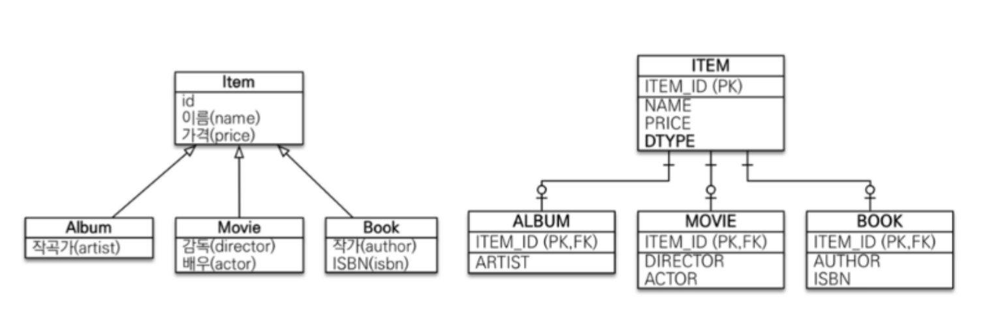
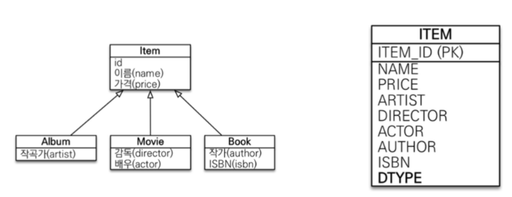
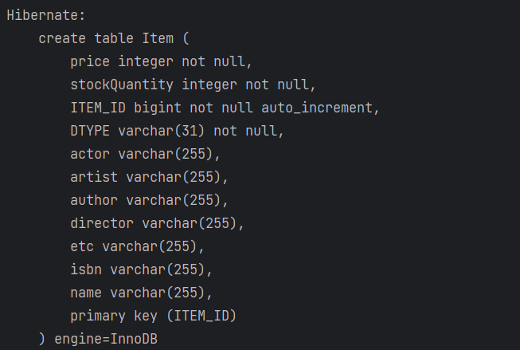
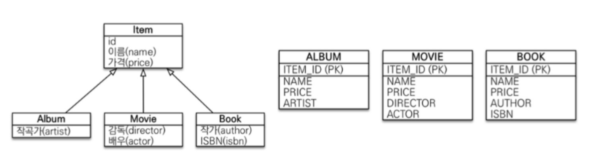

### 조인 전략

- item 이라는 테이블을 만들고 앨범, 영화, 책 테이블로 두고 **조인으로 테이블을 연결**
- 테이블에서 DTYPE 이라는 **구분을 위한 컬럼**을 두어 조인을 어떤 테이블로 할지 정해서 함.

##### 장점
- 데이터가 정규화 되어 있다.
- 제약 조건을 item 에 맞춰서 걸 수 있다.
- ITEM을 본다고 하면 ITEM 테이블만 보면 된다.
- 저장공간이 효율적이다.

##### 단점
- 조회시 조인을 많이 사용하여 성능이 저하될 수 있다.
- 데이터 저장시 INSERT SQL 2번 호출

### 단일 테이블 전략

- **논리 모델을 한 테이블로 다 합쳐버리는 것**
- **pk를 그대로 두고 컬럼들 다 떄려 박는 것**
- 실제 SINGLE_TABLE 적용 시 날아가는 SQL 문

##### 장점
- **조인이 필요 없어 일반적으로 조회 성능이 빠름**
- pk를 던지면 바로 나옴

##### 단점
- **자식 엔티티가 매핑한 컬럼은 모두 null 허용**

### 구현 클래스마다 테이블을 만드는 전략

- 자식 테이블을 모두 각각 만들고 name 과 price를 다 각각 가져서 만드는 방법
- 전부 각각 가져와버리는 것

##### 상당히 비추
- **객체 지향과 DB 둘다 싫어하는 전략**

### 결론
- 조인 전략을 기본으로 가져가자
- 정말 단순해 확장 가능할 일이 없어 보인다 => **단일 테이블 전략**
- 비즈니스적으로 정말 중요하고 복잡하다 => **조인 전략**
