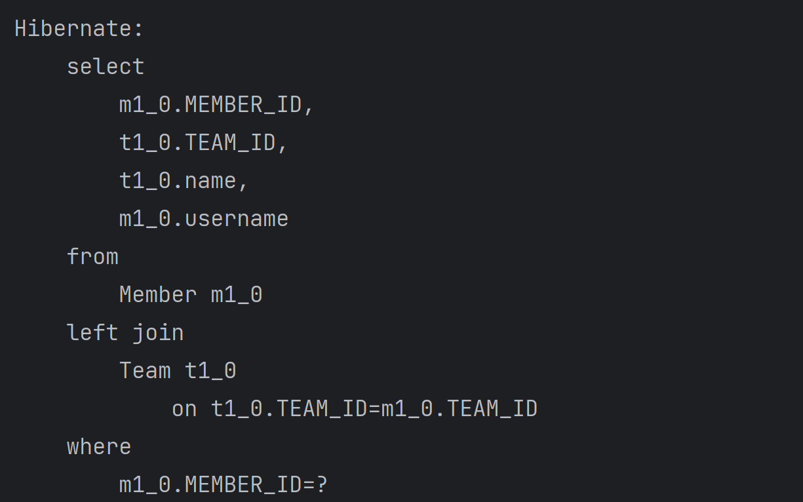
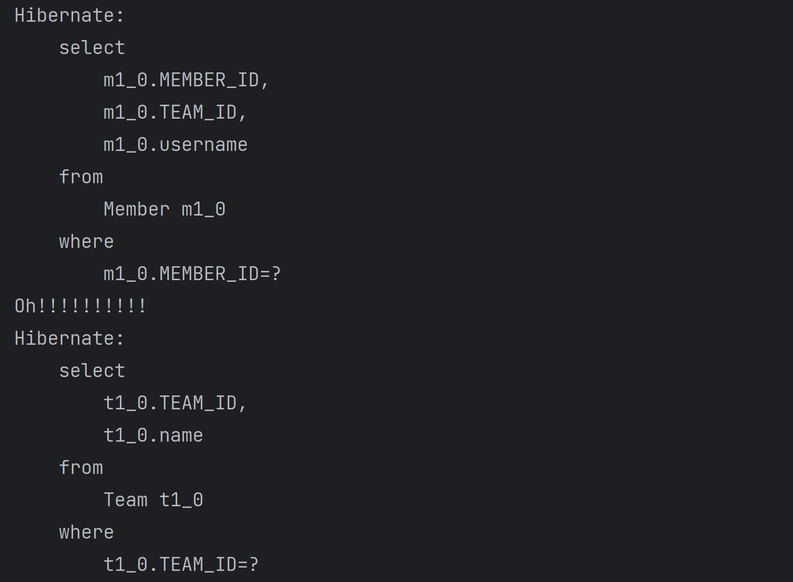

### 프록시
- 엔티티를 조회할 때 연관된 엔티티들이 항상 사용되는 것은 아니다.
- JPA는 이런 문제를 해결하려고 **엔티티가 실제 사용될 때 까지 데이터베이스 조회를 지연**하는 방법을 제공하는데 이것을 **"지연로딩"** 이라 한다.
- 지연 로딩 기능을 사용하려면 실제 엔티티 객체 대신 **데이터베이스 조회를 지연할 수 있는 가짜 객체**가 필요한데 이것을 **"프록시 객체"** 라 한다.
- 엔티티를 실제 사용하는 시점까지 데이터베이스 조회를 미루고 싶으면 `EntityManager.getReference()` 메소드를 사용
- 이 메서드를 호출할 때 JPA는 데이터베이스를 조회하지 않고 실제 엔티티 객체도 생성하지 않는 대신 데이터베이스 접근을 위힘한 **프록시 객체를 반환**한다.
- 프록시 클래스는 실제 클래스와 겉 모양이 같기 떄문에, **사용하는 입장에서는** 이것이 진짜 객체인지 프록시 객체인지 **구분하지 않고 사용**하면 된다.
- 프록시 객체는 **실제 객체에 대한 참조를 보관**한다.
- 프록시 객체의 메소드를 호출하면 프록시 객체는 실제 객체의 메소드를 호출한다.
- 프록시 객체는 `member.getName()`처럼 **실제 사용될 때** 데이터베이스를 조회해서 **실제 엔티티 객체를 생성**하는데 이것을 **프록시 객체의 초기화**라 한다.
- 프록시 클래스 예상 코드
- ```
  class MemberProxy extends Member {
    Member target = null; //실제 엔티티 참조
    
    public String getName() {
    
        if (target == null) {
            
            //2. 초기화 요청
            //3. DB 조회
            //4. 실제 엔티티 생성 및 참조 보관
            this.target = ...;
        }
        
        //5. target.getName();
        return target.getName();
    }
  }  
  ```
### 프록시의 특징
- 프록시 객체는 처음 사용할 때 한 번만 초기화 된다.
- 프록시 객체를 초기화한다고 프록시 객체가 실제 엔티티로 바뀌는 것은 아니다.
- 프록시 객체가 초기화되면 프록시 객체를 통해서 실제 엔티티에 접근할 수 있다.
- 프록시 객체는 원본 엔티티를 상속받은 객체이므로 타입 체크 시에 주의해서 사용해야 한다.
- 영속성 컨텍스트에 찾는 엔티티가 이미 있으면 데이터베이스를 조회할 필요가 없으므로 `em.getReference()`를 호출해도 프록시가 아닌 실제 엔티티를 반환한다.
- 초기화는 영속성 컨텍스트의 도움을 받아야 가능하다.
- 따라서 영속성 컨텍스트의 도움을 받을 수 없는 준영속 상태의 프록시를 초기화하면 문제가 발생한다.
- 하이버네이트는 `org.hibernate.LazyInitializationException`예외를 발생시킨다.

### 프록시와 식별자
- 엔티티를 프록시로 조회할 때 식별자(PK)값을 파라미터로 전달하는데 **프록시 객체**는 이 **식별자 값을 보관**한다.
- 프록시는 다음 코드처럼 연관관계를 설정할 때 유용하게 사용할 수 있다.
- ```
  Member member = em.find(Member.class, "member1");
  
  //SQL을 실행하지 않음
  Team team = em.getReference(Team.class, "team1");
   
  member.setTeam(team);
  ```
### 즉시 로딩과 지연 로딩
- **프록시 객체**는 주로 연관된 엔티티를 **지연 로딩할 때 사용**한다.
- ```
  Member member = em.find(Member.class, "member1);
  Team team = member.getTeam(); //객체 그래프 탐색
  System.out.println(team.getName()); //팀 엔티티 사용
  ```
- 즉시 로딩
  - 엔티티를 조회할 때 연관된 엔티티도 함께 조회한다.
  - 예: `em.find(Member.class, "member1");`을 호출할 때 회원 엔티티와 관련된 팀 엔티티도 함께 조회한다.
  - 설정 방법: `@ManyToOne(fetch = FetchType.EAGER)`
- 지연 로딩
  - 연관된 엔티티를 실제 사용할 때 조회한다.
  - 예: `member.getTeam().getName();`처럼 조회한 팀 엔티티를 실제 사용하는 시점에 JPA가 SQL을 호출해서 팀 엔티티를 조회한다.
  - 설정 방법: `@ManyToOne(fetch = FetchType.LAZY)`
### 즉시 로딩
- `em.find(Member.class, 1L);`로 회원을 조회하는 순간 팀도 함께 조회한다.
- 이 때 회원과 팀 두 테이블을 조회해야 하므로 쿼리를 2번 실행할 것 같지만
- 대부분의 JPA 구현체는 **즉시 로딩을 최적화하기 위해 가능하면 조인 쿼리를 사용**한다.
- 즉시 로딩 실행 SQL
  
### 지연 로딩
- `en.find(Member.class, 1L);`를 호출하면 회원만 조회하고 **팀은 조회하지 않는다.**
- **대신 team 멤버변수에 프록시 객체를 넣어둔다.**
- `Team proxyTeam = member.getTeam();`에서 반환된 팀 객체는 프록시 객체다.
- **이 프록시 객체는 실제 사용될 때까지 데이터 로딩을 미룬다.**
- `proxyTeam.getName();` 이 때 팀 객체가 실제 사용되고 팀 객체를 조회한다.
- 지연 로딩 실행 SQL
  
### 참고
- **조회 대상이 영속성 컨텍스트에 이미 있으면 프록시 객체를 사용할 이유가 없다.**
- 따라서 프록시가 아닌 실제 객체를 사용한다.
- 예를 들어 team1 엔티티가 영속성 컨텍스트에 이미 로딩되어 있으면 프록시가 아닌 실제 team1 엔티티를 사용한다.
### 정리
- **지연 로딩과 즉시 로딩을 언제 사용할 지는 상황에 따라 다르다!!**
- **지연 로딩(LAZY)**: 연관된 엔티티를 프록시로 조회한다. 프록시를 실제 사용할 때 초기화하면서 데이터베이스를 조회한다.
- **즉시 로딩(EAGER)**: 연관된 엔티티를 즉시 조회한다. 하이버네이트는 가능하면 SQL 조인을 사용해서 한 번에 조회한다.
### JPA 기본 페치 전략
- fetch 속성의 기본 설정값은 다음과 같다.
- `@ManyToOne`, `@OneToOne`: 즉시 로딩(`FetchType.EAGER`)
- `@OneToMany`, `@ManyToMany`: 지연 로딩(`FetchType.LAZY`)
- JPA의 기본 페치 전략은 **연관된 엔티티가 하나면 즉시 로딩**을, **컬렉션이면 지연 로딩**을 사용한다.
- **추천하는 방법은 모든 연관관계에 지연 로딩을 사용하는 것이다.**
- 그리고 애플리케이션 개발이 어느 정도 완료단계에 왔을 때 실제 사용하는 상황을 보고 꼭 필요한 곳에만 즉시 로딩을 사용하도록 최적화하면 된다.
### 영속성 전이: CASCADE
- 특정 엔티티를 영속 상태로 만들 때 **연관된 엔티티도 함께 영속 상태로 만들고 싶으면 영속성 전이(transitive persistence)** 기능을 사용하면 된다.
- JPA 는 `CASCADE`옵션으로 영속성 전이를 제공
- 쉽게 말해 영속성 전이를 사용하면 부모 엔티티를 저장할 때 자식 엔티티도 함께 저장할 수 있다. (삭제도 가능.)
### 고아 객체
- JPA는 **부모 엔티티와 연관관계가 끊어진 자식 엔티티를 자동으로 삭제**하는 기능을 제공하는데 이것을 **고아 객체(ORPHAN) 제거** 라 한다.
- **부모 엔티티의 컬렉션에서 자식 엔티티의 참조만 제거하면 자식 엔티티가 자동으로 삭제**
- 고아 객체 제거는 참조가 제거된 엔티티는 다른 곳에서 참조하지 않는 고아 객체로 보고 삭제하는 기능이다.
- 따라서 이 기능은 **참조하는 곳이 하나일 때만 사용**해야 한다.
- 이러한 이유로 `orphanRemovel` 은 `@OneToOne`, `@OneToMany` 에만 사용할 수 있다.
- 개념적으로 볼 때 부모를 제거하면 자식은 고아가 된다. 따라서 **부모를 제거하면 자식도 같이 제거**된다.
- 이것은 `CascadeType.REMOVE`를 설정한 것과 같다.

### 지연 로딩, 영속성 전이
- 지연 로딩은 READ 측면에서 동작, 영속성 전이는 CREATE, UPDATE, DELETE 측면에서 동작
- **지연 로딩 (Lazy Loading)**: Read 작업 시 데이터베이스 조회를 지연시켜 성능을 최적화합니다. 
- **영속성 전이 (Cascade)**: Create, Update, Delete 작업이 연관된 엔티티에도 자동으로 수행되어 데이터 일관성을 유지합니다.
