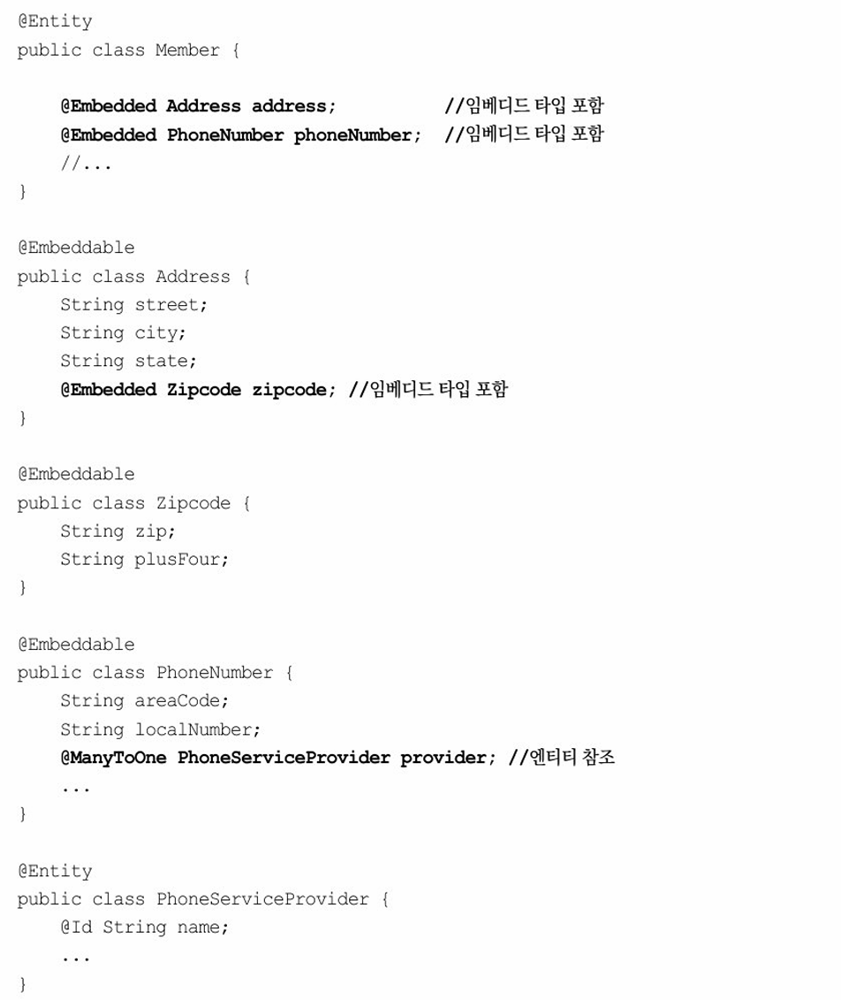
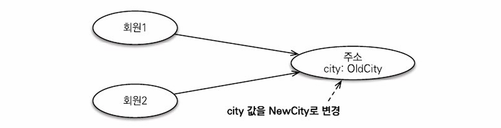
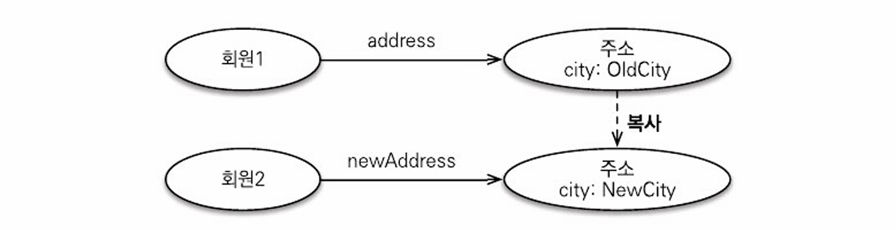
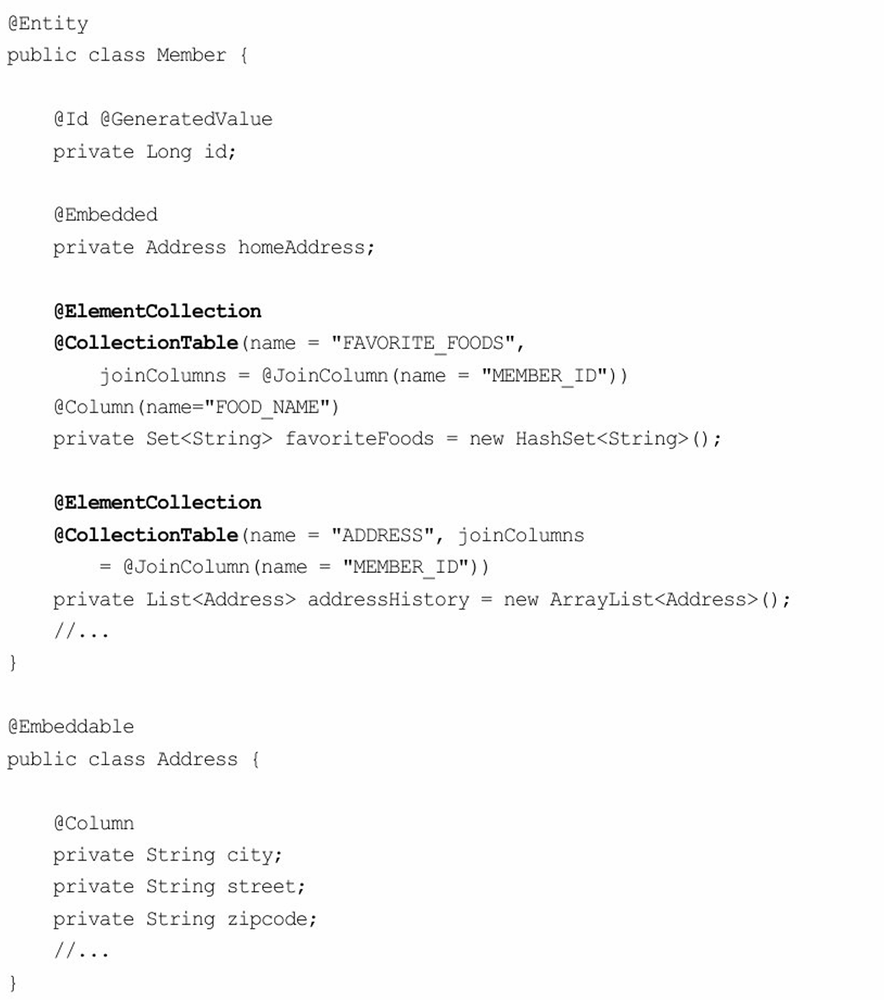
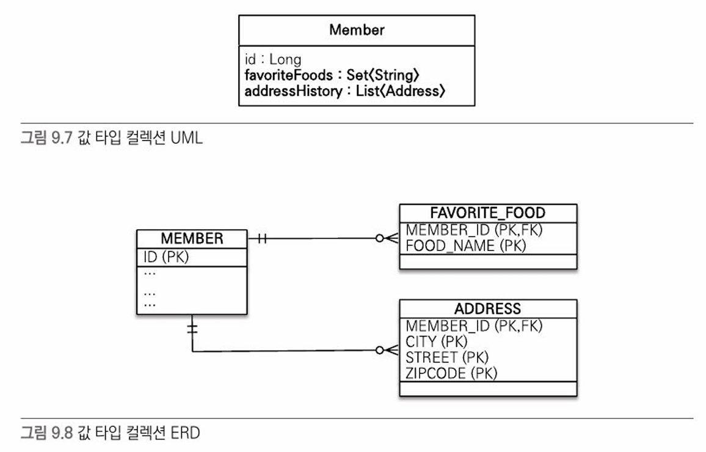
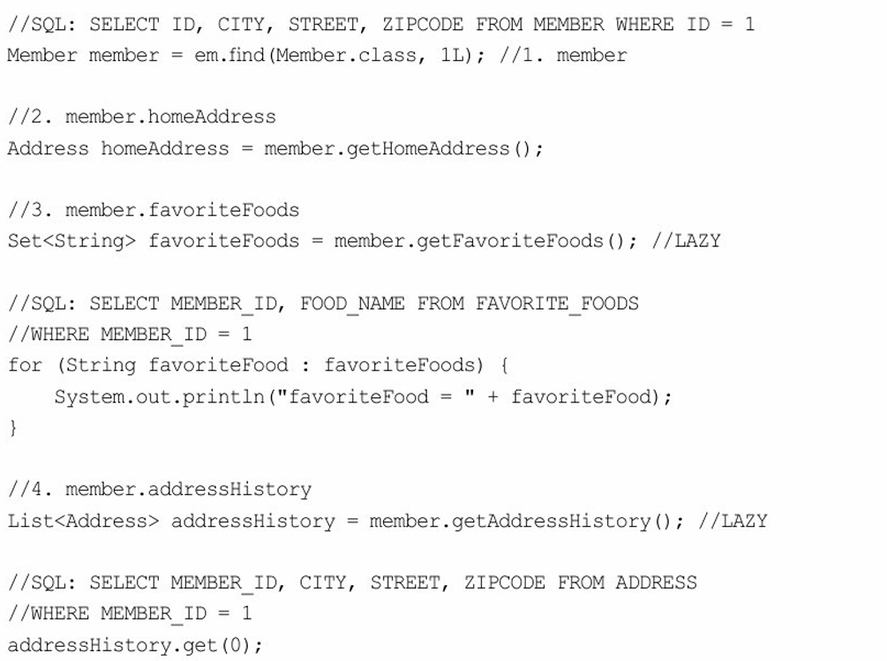

    기본값 타입은 자바가 제공하는 기본 데이터 타입
    임베디드 타입은 JPA 에서 사용자가 직접 정의한 값 타입
    컬렉션 값 타입은 하나 이상의 값 타입을 저장할 때 사용

### 임베디드 타입(복합 값 타입)
- **새로운 값 타입을 직접 정의해서 사용**할 수 있는데, JPA 에서는 이것을 **임베디드 타입**이라 한다.
- 임베디드 타입은 기본 생성자가 필수
- 임베디드 타입을 포함한 모든 값 타입은 엔티티의 생명주기에 의존하므로 엔티티와 임베디드 타입의 관계를 UML로 표현하면 **컴포지션 관계**가 된다.
- **임베디드 타입은 엔티티의 값**일 뿐이다.
  - 따라서 값이 속한 엔티티의 테이블에 매핑한다.
- `@Embeddable`: 값 타입을 정의하는 곳에 표시
- `@Embedded`: 값 타입을 사용하는 곳에 표시

### 임베디드 타입과 연관관계
- 임베디드 타입은 **값 타입을 포함**하거나 **엔티티를 참조**할 수 있다.
- 

### @AttributeOverride: 속성 재정의
- 임베디드 타입에 정의한 매핑정보를 재정의하려면 엔티티에 `@AttributeOverride`를 사용하면 된다.
- ```
  @Embedded Address homeAddress;
  
  @Embeddedd
  @AttributeOverrides({
    @AttributeOverride(name="city', column=@Column(name="COMPANY_CITY")),
    @AttributeOverride(name="street', column=@Column(name="COMPANY_STREET")),
    @AttributeOverride(name="zipcode', column=@Column(name="COMPANY_ZIPCODE")),
  })
  Address companyAddress;
  ```
- ```
  CREATE TABLE MEMBER (
    COMPANY_CITY varchar(255),
    COMPANY_STREET varchar(255),
    COMPANY_ZIPCODE varchar(255),
    city varchar(255),
    street varchar(255),
    zipcode varchar(255),
    ...
  )
  ```
- `@AttributeOverride`를 사용하면 어노테이션을 너무 많이 사용해서 엔티티 코드가 지저분 해진다.
- 하지만 한 엔티티에 같은 임베디드 타입을 중복해서 사용하는 일은 많지 않다.

### 임베디드 타입과 null
- 임베디드 타입이 null 이면 매핑한 컬럼 값은 모두 null이 된다.
- ```
  member.setAddress(null);
  em.persist(member);
  ```
- 위 코드를 실행하게 되면 회원 테이블의 주소와 관련된 CITY, STREET, ZIPCODE 컬럼 값은 모두 null이 된다.

## 값 타입과 불변 객체
- 값 타입은 복잡한 객체 세상을 조금이라도 단순화하려고 만든 개념이다. 따라서 **값 타입은 단순하고 안전하게 다룰 수 있어야 한다.**

### 값 타입 공유 참조
- 임베디드 타입 같은 값 타입을 여러 엔티티에서 공유하면 위험하다.
- 
- 공유 참조로 인해 발생하는 버그는 정말 찾아내기 어렵다.
- 뭔가를 수정했는데 전혀 예상치 못한 곳에서 문제가 발생하는 것을 **부작용** 이라 한다.

### 값 타입 복사
- 값 타입의 실제 인스턴스인 값을 공유하는 것은 위험하다.
- 대신에 값(인스턴스)을 복사해서 사용해야 한다.
- 
- 항상 값을 복사해서 사용하면 공유 참조로 인해 발생하는 부작용을 피할 수 있다.
- 문제는 임베디드 타입처럼 직접 정의한 값 타입은 **자바의 기본 타입이 아니라 객체 타입**이라는 것이다.
- 자바는 기본 타입에 값을 대입하면 값을 복사해서 전달한다.
- Address같은 객체 타입의 경우, 자바는 객체에 값을 대입하면 항상 참조 값을 전달한다.
- ```
  Address a = new Address("Old");
  Address b = a; //객체 타입은 항상 참조 값을 전달한다.
  b.setCity("New");
  ```
- a 와 b는 같은 인스턴스를 공유 참조한다.
- 마지막 줄의 `b.setCity("new")`의 의도는 b.city 값만 변경하려 했지만 공유 참조로 인해 부작용이 발생하여 a.city 값도 변경된다.
- 물론 객체를 대입할 때마다 인스턴스를 복사해서 대입하면 공유 참조를 피할 수 있다.
- **문제는 복사하지 않고 원본의 참조 값을 직접 넘기는 것을 막을 방법이 없다는 것**이다.
- **객체의 공유 참조는 피할 수 없다.** 따라서 가장 단순한 방법은 객체의 값을 수정하지 못하게 막으면 된다.
- 예를 들어 Address 객체의 setCity() 같은 수정자 메소드를 모두 제거하자. 이렇게 하면 공유 참조를 해도 값을 변경하지 못하므로 부작용의 발생을 막을 수 있다.

### 불변 객체
- **객체를 불변하게 만들면 값을 수정할 수 없으므로 부작용을 원천 차단**할 수 있다.
- **따라서 값 타입은 될 수 있으면 불변 객체로 설계해야 한다.**
- 한 번 만들면 절대 변경할 수 없는 객체를 불변 객체라 한다.
- 불변 객체를 구현하는 가장 간단한 방법은 생성자로만 값을 설정하고 수정자를 만들지 않으면 된다.

## 값 타입의 비교
- **동일성** 비교: 인스턴스의 **참조 값**을 비교, == 사용
- **동등성** 비교: 인스턴스의 **값**을 비교, equals() 사용

## 값 타입 컬렉션
- 값 타입을 하나 이상 저장하려면 컬렉션에 보관하고 `@Elementcollection`, `@CollectionTable`어노테이션을 사용하면 된다.
- 
- 
- **값 타입 컬렉션**도 조회할 때 **페치 전략**을 선택할 수 있는데 **LAZY가 기본**이다.
- 

### 값 타입 컬렉션의 제약사항
- 엔티티는 식별자가 있으므로 엔티티의 값을 변경해도 식별자로 데이터베이스에 저장된 원본 데이터를 쉽게 찾아서 변경할 수 있다.
- 반면 값 타입은 식별자라는 개념이 없고 단순한 값들의 모음이므로 값을 변경해버리면 데이터베이스에 저장된 원본 데이터를 찾기는 어렵다.
- 특정 엔티티 하나에 소속된 값 타입은 변경되어도 자신이 소속된 엔티티를 데이터베이스에서 찾고 값을 변경하면 된다.
- 문제는 값 타입 컬렉션이다.
- 값 타입 컬렉션에 보관된 값 타입들은 별도의 테이블에 보관된다.
- 따라서 여기에 보관된 값 타입의 값이 변경되면 데이터베이스에 있는 원본 데이터를 찾기 어렵다는 문제가 있다.
- 이러한 문제로 인해 JPA 구현체들은 **값 타입 컬렉션에 변경 사항이 발생하면, 값 타입 컬렉션이 매핑된 테이블의 연관된 모든 데이터를 삭제하고, 현재 값 타입 컬렉션 객체에 있는 모든 값을 데이터베이스에 다시 저장**한다.
- 따라서 실무에서는 값 타입 컬렉션이 매핑된 테이블에 데이터가 많다면 값 타입 컬렉션 대신 일대다 관계를 고려해야 한다.

## 정리
### 엔티티 타입
- 식별자가 있다.(`@id`)
  - 엔티티 타입은 식별자가 있고 식별자로 구별할 수 있다.
- 생명 주기가 있다.
  - 생성하고, 영속화하고, 소멸하는 생명 주기가 있다.
  - `em.persist(entity)`로 영속화한다.
  - `em.remove(entity)`로 제거한다.
- 공유할 수 있다.
  - 참조 값을 공유할 수 있다. 이것을 공유 참조라 한다.
  - 예를 들어 회원 엔티티가 있다면 다른 엔티티에서 얼마든지 회원 엔티티를 참조할 수 있다.

### 값 타입
- 식별자가 없다.
- 생명 주기를 엔티티에 의존한다.
  - 스스로 생명주기를 가지지 않고 엔티티에 의존한다. 의존하는 엔티티를 제거하면 같이 제거된다.
- 공유하지 않는 것이 안전하다.
  - 엔티티 타입과는 다르게 공유하지 않는 것이 안전하다. 대신에 값을 복사해서 사용해야 한다.
  - 오직 하나의 주인만이 관리해야 한다.
  - 불변 객체로 만드는 것이 안전하다.

- 값 타입은 정말 값 타입이라 판단될 때만 사용해야 한다. 
- 특히 엔티티와 값 타입을 혼동해서 엔티티를 값 타입으로 만들면 안된다.
- 식별자가 필요하고 지속해서 값을 추적하고 구분하고 변경해야 한다면 그것은 값 타입이 아닌 엔티티다.

