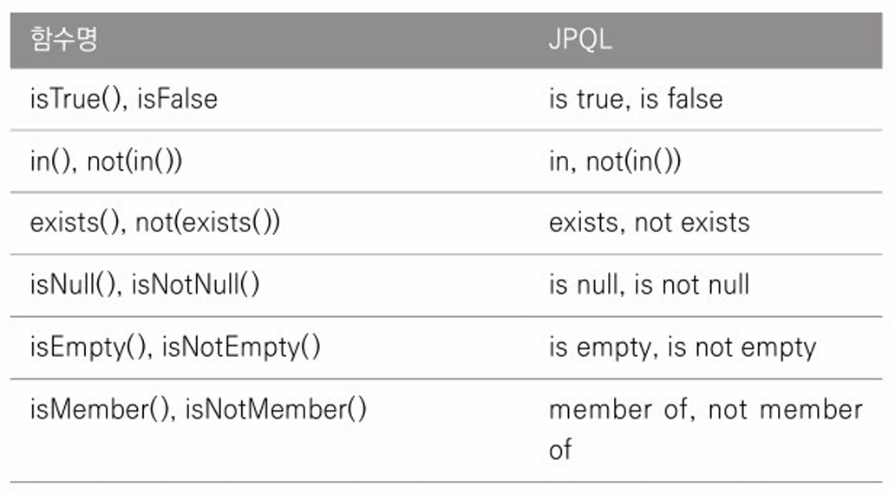

## Criteria

Criteria 쿼리는 **JPQL을 자바 코드로 작성하도록 도와주는 빌더 클래스 API** 이다.  
Criteria 를 사용하면 문자가 아닌 **코드로 JPQL을 작성하므로 문법 오류를 컴파일 단계에서 잡을 수** 있고, 문자 기반의 JPQL 보다 **동적 쿼리를 안전하게 생성**할 수 있다.  
하지만 실제 Criteria를 사용해서 개발해보면 코드가 복잡하고 장황해서 직관적으로 이해하기  힘들다는 단점이 있다.  

### Criteria 기초
Criteria API는 `javax.persistence.criteria` 패키지에 있다.  
가장 단순한 Criteria 쿼리부터 살펴보자.
```
//JPQL: select m from Member m

CriteriaBuilder cb = em.getCriteriaBuilder(); //Criteria 쿼리 빌더

//Criteria 생성, 반환 타입 지정
CriteriaQuery<Member> cq = cb.createQuery(Member.class);

Root<Member> m = cq.from(Member.class); //FROM 절
cq.select(m); //select 절

TypedQuery<Member> query = em.createQuery(cq);
List<Member> members = query.getResultList();
```
다음은 검색 조건(where)과 정렬(order by)을 추가해보자.
```
//JPQL
/*
select m from Member m
where m.username = '회원1'
order by m.age desc
*/

CriteriaBuilder cb = em.getCriteriaBuilder();

CriteriaQuery<Member> cq = cb.createQuery(Member.class);
Root<Member> m = cq.from(Member.class); //FROM 절 생성

//검색 조건 정의
Predicate usernameEqual = cb.equal(m.get("username"), "회원1");

//정렬 조건 정의
javax.persistence.criteria.Order ageDesc = cb.desc(m.get("age));

//쿼리 생성
cq.select(m)
    .where(usernameEqual) //WHERE 절 생성
    .orderBy(ageDesc); //ORDER BY 절 생성
    
List<Member> members = em.createQuery(cq).getResultList();    
```
쿼리 루트(`Query Root`)와 별칭을 알아보자.
- Root<Member> m = cq.from(Member.class); 여기서 m 이 쿼리 루트다.
- 쿼리 루트는 조회의 시작점이다.
- Criteria에서 사용되는 특별한 별칭이다. JPQL의 별칭이라 생각하면 된다.
- 별칭은 엔티티에만 부여할 수 있다.

Criteria는 코드로 JPQL을 완성하는 도구이기에 경로 표현식도 있다.
- m.get("username") 은 JPQL의 m.username 과 같다.
- m.get("team").get("name") 은 JPQL의 m.team.name 과 같다.

```
//숫자 타입 검색
//select m from Member m
//where m.age > 10 order by m.age desc

CriteriaQuery<Member> cq = cb.createQuery(Member.class);
Root<Member> m = cq.from(Member.class);

//타입 정보 필요
Predicate ageGt = cb.greaterThan(m.<Integer>get("age"), 10);

cq.select(m)
    .where(ageGt)
    .orderBy(cb.desc(m.get("age")));
```
- m.<Integer>get("age")에서 m.get("age")에서는 "age"의 타입 정보를 알지 못한다. 따라서 제네릭으로 반환 타입 정보를 명시해야 한다.  

#### 조회
- 조회 대상을 한 건, 여러 건 지정
  - select 에 조회 대상을 하나만 지정하려면 `cq.select(m) //JPQL: select m` 처럼 작성하면 된다.
  - 조회 대상을 여러 건을 지정하려면 `multiselect`를 사용하면 된다.
  ```
  //JPQL: select m.username, m.age
  cq.multiselect(m.get("username"), m.get("age"));
  ```
  - 여러 건 지정은 `cb.array`를 사용해도 된다.
  ```
  cq.select(cb.array(m.get("username"), m.get("age"));
  ```
#### DISTINCT
  - distinct 는 select, multiselect 다음에 `distinct(true)`를 사용하면 된다.
  ```
  //JPQL: select distinct m.username, m.age from Member m
  
  CriteriaQuery<Member> cq = cb.reateQuery(Object[].class);
  Root<Member> m = cq.from(Member.class);
  
  //cq.select(cb.array(m.get("username"), m.get("age"))).distinct(true);
  cq.multiselect(m.get("username"), m.get("age")).distinct(true);
  
  TypedQuery<Object[]> query = em.createQuery(cq);
  List<Object[]> resultList = query.getResultList();
  ```

#### NEW, construct()
  - JPQL에서 select new 생성자() 구문을 Criteria 에서는 cb.construct(클래스타입, ...)로 사용한다.
  ```
  //JPQL: select new jpabook.domain.MemberDTO(m.username, m.age) from Member m
  CriteriaQuery<MemberDTO> cq = cb.createQuery(MemberDTO.class);
  Root<Member> m = cq.from(Member.class);
  
  cq.select(cb.construct(MemberDTO.class, m.get("username"), m.get("age")));
  
  TypedQuery<MemberDTO> query = em.createQuery(cq);
  List<MemberDTO> resultList = query.getResultList();
  ```
  - JPQL에서는 패키지명을 다 적어주었지만, Criteria는 코드를 직접 다루므로 MemberDTO.class 처럼 간략하게 사용할 수 있다.

#### 튜플
  - Criteria는 Map과 비슷한 튜플이라는 특별한 반환 객체를 제공한다.
  ```
  //JPQL: select m.username, m.age from Member m
  
  CriteriaBuilder cb = em.getCriteriaBuiler();
  
  //CriteraiQuery<Tuple> cq = cb.createQuery(Tuple.class);
  CriteriaQuery<Tuple> cq = cb.createTupleQuery();
  
  Root<Member> m = cq.from(Member.class);
  cq.multiselect(
    m.get("username").alias("username"), //튜플에서 사용할 튜플 별칭
    m.get("age").alias("age")
  );
  
  TypedQuery<Tuple> query = em.createQuery(cq);
  List<Tuple> resultList = query.getResultList();
  for (Tuple tuple : resultList) {
    //튜플 별칭으로 조회
    String username = tuple.get("username", String.class);
    Integer age = tuple.get("age", Integer.class);
  }
  ```
  - 튜플을 사용할 때는 **별칭을 필수로 주어야 하는 것에 주의**하자!!
> 참고)  
> **튜플은 이름 기반**이므로 순서 기반의 Object[] 보다 안전하다  
> 튜플에 별칭을 준다고 해서 실제 SQL에 별칭이 달리는 것은 아니다.  
> **튜플은 Map과 비슷한 구조여서 별칭을 키로 사용**한다.

### 집합
#### GROUP BY
```
//팀 이름별로 나이가 가장 많은 사람과 가장 적은 사람을 구해보자
/*
    JPQL:
    select m.team.name, max(m.age), min(m.age)
    from Member m
    group by m.team.name
*/

CriteriaBuilder = em.getCriteriaBuilder();
CriteriaQuery<Object[]> cq = cb.createQuery(Object[].class);
Root<Member> m = cq.from(Member.class);

Expression maxAge = cb.max(m.<Integer>get("age"));
Expression minAge = cb.min(m.<Integer>get("age"));

cq.multiselect(m.get("team").get("name"), maxAge, minAge);
cq.groupBy(m.get("team").get("name")); //GROUP BY

TypedQuery<Object[]> query = em.createQuery(cq);
List<Object[]> resultList = query.getResultList();
```

#### HAVING
```
//위 조건에 팀에 가장 나이 어린 사람이 10살을 초과하는 팀을 조회한다는 조건을 추가해보자
cq.multiselect(m.get("team").get("name"), maxAge, minAge)
    .groupBy(m.get("team").get("name")
    .having(cb.gt(minAge, 10)); //HAVING
```

#### 정렬
```
cq.select(m)
    .where(ageGt)
    .orderBy(cb.desc(m.get("age")));
```

#### 조인
```
/*
    JPQL:
    select m, t from Member m
    inner join m.team t
    where t.name = '팀A'
*/

CriteriaBuilder cb = em.getCriteriaBuilder();
CriteriaQuery<Object[]> cq = cb.createQuery(Object[].class);
Root<Member> m = cq.from(Member.class);
Join<Member, Team> t = m.join("team", JoinType.INNER); //내부 조인

cq.multiselect(m, t)
    .where(cb.equal(t.get("name"), "팀A"));
```
- 조인 타입에는 INNER, LEFT, RIGHT, FETCH 등이 있고 **조인 타입 생략시에는 내부 조인을 사용**한다.

#### 서브 쿼리
- 간단한 서브쿼리
  ```
  /*
    JPQL:
    select m from Member m
    where m.age >=
        (select AVG(m2.age) from Member m2)
  */
  
  CriteriaBuilder cb = em.getCriteriaBuilder();
  CriteriaQuery<Member> mainQuery = cb.createQeury(Member.class);
  
  //서브쿼리 생성
  CriteriaQuery<Double> subQuery = cb.createQuery(Double.class);
  Root<Member> m2 = subQuery.from(Member.class);
  subQuery.select(cb.avg(m2.<Integer>get("age")));
  
  //메인쿼리 생성
  Root<Member> m = mainQuery.from(Member.class);
  mainQuery.select(m)
        .where(cb.ge(m.<Integer>get("age"), subQuery);
  ```
- 상호 관련 서브쿼리
  ```
  /*
    JPQL:
    select m from Member m
    where exists
        (select t from m.team t where t.name = '팀A')
  */
  CriteriaBuilder cb = em.getCriteriaBuilder();
  CriteriaQuery<Member> mainQuery = cb.createQuery(Member.class);
  
  //서브쿼리에서 사용되는 메인쿼리의 m
  Root<Member> m = mainQuery.from(Member.class)
  
  //서브 쿼리 생성
  Subquery<Team> subQuery = mainQuery.subquery(Team.class);
  Root<Member> subM = subQuery.correlate(m);
  
  Join<Member, Team> t = subM.join("team");
  subQuery.select(t)
    .where(cb.equal(t.get("name"), "팀A");
  
  //메인 쿼리 생성
  mainQuery.select(m)
    .where(cb.exists(subQuery));
  ```

#### IN식
```
/*
    JPQL:
    select m from Member m
    where m.username in ("회원1", "회원2")
    
    CriteriaBuilder cb = em.getCriteriaBuilder();
    CriteriaQuery<Member> cq = cb.createQuery(Member.class);
    Root<Member> m = cq.from(Member.class);
    
    cq.select(m)
        .where(cb.in(m.get("username")
            .value("회원1")
            .value("회원2"));
*/
```

#### CASE 식
```
/*
    JPQL
    select m.username,
        case when m.age >= 60 then 600
             when m.age <= 15 then 500
             else 1000
        end
    from Member m
*/

Root<Member> m = cq.from(Member.class);

cq.multiselect(
    m.get("username"),
    cb.selectCase()
        .when(cb.ge(m.<Integer>get("age"), 60), 600)
        .when(cb.le(m.<Integer>get("age"), 15), 500)
        .otherwise(1000)
);
```

#### 파라미터 정의
```
/*
    JPQL:
    select m from Member m
    where m.username = :usernameParam
*/

CriteriaBuilder cb = em.getCriteriaBuilder();
CriteriaQuery<Member> cq = cb.createQuery(Member.class);
Root<Member> m = cq.from(Member.class);

//정의 ; cb.paramager(타입, 파라미터 이름)
cq.select(m)
    .where(cb.equal(m.get("username"), cb.parameter(String.class, "usernameParam")));

List<Member> resultList = em.createQuery(cq)
    .setParameter("usernameParam", "회원1") //바인딩
    .getResultList();
```

#### 네이티브 함수 호출
```
Root<Member> m = cq.from(Member.class);
Expression<Long> function = cb.function("SUM", Long.class, m.get("age"));
cq.select(function);
```

#### 동적 쿼리
동적 쿼리는 문자 기반인 JPQL보다는 코드 기반인 Criteria로 작성하는 것이 더 편리하다.
```
//검색 조건
Integer age = 10;
String username = null;
String teamName = "팀A";

//JPQL 동적 쿼리 생성
StringBuilder jpql = new StringBuilder("select m from Member m join m.team t ");
List<String> criteria = new ArrayList<String>();

if (age != null) criteria.add(" m.age = :age ");
if (username != null) criteria.add(" m.username = :username ");
if (teamName != null) criteria.add(" t.name = :teamName ");

if (criteria.size() > 0) jpql.append(" where ");

for (int i = 0; i < criteria.size(); i++) {
    if (i > 0) jpql.append(" and ");
    jpql.append(criteria.get(i));
}

TypedQuery<Member> query = em.createQuery(jpql.toString(), Member.class);
if (age != null) query.setParameter("age", age);
if (username != null) query.setParameter("username", username);
if (teamName != null) query.setParameter("teamName", teamName);

List<Member> resultList = query.getResultList();
```
위와 같이 JPQL로 동적 쿼리를 구성하는 것은 외줄타기이다. 문자 더하기로 인해 여러번 버그를 만날 것이고, 특히 문자 사이의 공백이나 where 와 and 의 위치 또한 신경을 써야한다.
```
//Criteria 동적 쿼리 생성
CriteriaBuilder cb = em.getCreteriaBuilder();
CriteriaQuery<Member> cq = cb.createQuery(Member.class);

Root<Member> m = cq.from(Member.class);
Join<Member, Team> t = m.join("team");

List<Predicate> criteria = new ArrayList<>();
if (age != null) criteria.add(cb.equal(m.<Integer>get("age"), cb.parameter(Integer.class, "age")));
if (username != null) criteria.add(cb.equal(m.get("username"), cb.parameter(String.class, "username")));
if (teamName != null) criteria.add(cb.equal(m.get("teamName"), cb.parameter(String.class, "teamName")));

cq.where(cb.and(criteria.toArray(new Predicate[0])));

TypedQuery<Member> query = em.createQuery(cq);
if (age != null) query.setParameter("age", age);
if (username != null) query.setParameter("username", username);
if (teamName != null) query.setParameter("teamName", teamName);

List<Member> resultList = query.getResultList();
```
Criteria로 동적 쿼리를 구성하면 **최소한 공백이나 where, and의 위치로 인해 에러가 발생하지는 않는다.**  
이런 장점에도 불구하고 **코드가 읽기 힘들다는 단점**은 여전히 남아있다.  

#### 함수 정리
- 조건 함수
  
  
- 스칼라와 기타 함수
  
- 집합 함수
  
- 분기 함수
  