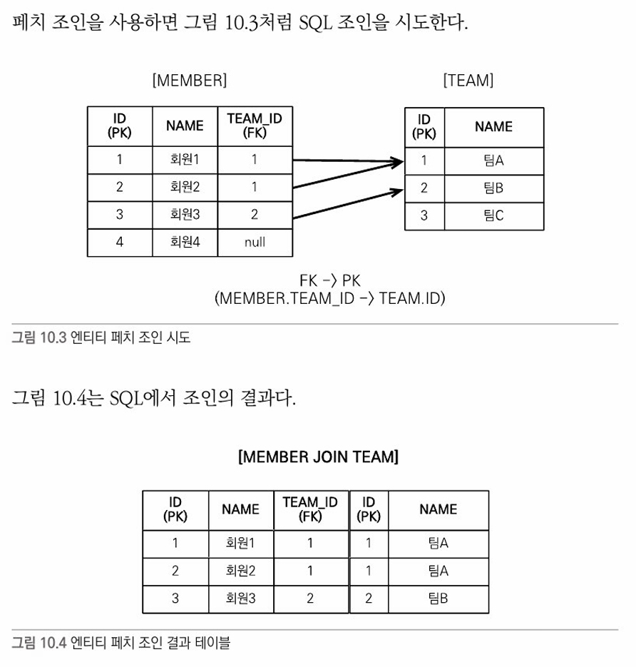
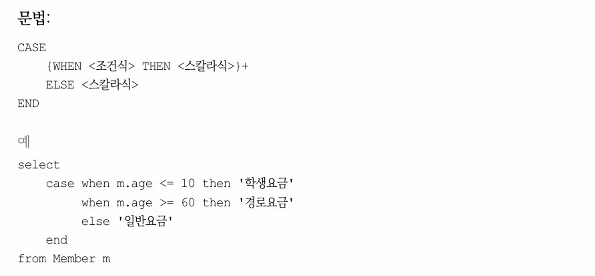

JPA는 복잡한 검색 조건을 사용해서 엔티티 객체를 조회할 수 있는 다양한 쿼리 기술을 지원한다.<br/>
JPQL은 가장 중요한 객체지향 쿼리 언어다.<br/>
Criteira 나 QueryDSL은 결국 JPQL을 편리하게 사용하도록 도와주는 기술이므로 JPA를 다루는 개발자라면 JPQL을 필수로 학습해야 한다.<br/>

## 객체지향 쿼리 소개
ORM을 사용하면 데이터베이스 테이블이 아닌 엔티티 객체를 대상으로 개발하므로 검색도 테이블이 아닌 엔티티 **객체를 대상으로** 하는 방법이 필요하다.<br/>
JPQL은 이런 문제를 해결하기 위해 만들어졌는데 다음과 같은 특징이 있다.
- 테이블이 아닌 **객체를 대상으로 검색하는 객체지향 쿼리**다.
- SQL을 추상화해서 **특정 데이터베이스 SQL에 의존하지 않는다.**

JPQL을 사용하면 JPQ는 JPQL을 분석한 다음 적절한 SQL을 만들어 데이터베이스를 조회한다. <br/>
그리고 조회한 결과로 엔티티 객체를 생성해서 반환한다.<br/>
JPQL을 한마디로 정의하면 **객체지향 SQL**이다.<br/>
JPQ는 JPQL뿐만 아니라 다양한 검색 방법을 제공한다.
- JPQL; Java Persistence Query Language
- Criteria 쿼리; JPQL을 편하게 작성하도록 도와주는 API, 빌더 클래스 모음
- 네이티브 SQL; JPA에서 JPQL대신 직접 SQL을 사용할 수 있다.

다음은 JPA가 공식 지원하는 기능은 아니지만 알아둘 가치가 있다.
- QueryDSL; Criteria 쿼리처럼 JPQL을 편하게 작성하도록 도와주는 빌더 클래스 모음, 비표준 오픈소스 프레임워크다.
- JDBC 직접 사용, MyBatis 같은 SQL 매퍼 프레임워크 사용; 필요하면 JDBC를 직접 사용할 수 있다.

### JPQL 소개
**JPQL은 엔티티 객체를 조회하는 객체지향 쿼리다.** 문법은 SQL과 비슷하다.<br/>
**JPQL은 SQL을 추상화해서 특정 데이터베이스에 의존하지 않는다.** 그리고 데이터베이스 방언(Dialect)만 변경하면 JPQL을 수정하지 않아도 자연스럽게 데이터베이스를 변경할 수 있다.<br/>
**JPQL은 SQL보다 간결하다.** 

### Creteria 쿼리 소개
**Criteria 는 JPQL을 생성하는 빌더 클래스**이다.<br/>
**qeury.select(m).where(...)처럼 프로그래밍 코드로 JPQL을 작성**할 수 있다는 점이다.  
- 예를들어 **JPQL 에서 select m from Membeee m 처럼 오타가 있다고 가정**해보자. 컴파일은 성공하고 애플리케이션을 서버에 배포할 수 있지만, 해당 쿼리가 실행되는 **런타임 시점에 오류가 발생**한다는 점이다.  
- **반면 Criteria**는 문자가 아닌 **코드로 JPQL을 작성**한다. 따라서 **컴파일 시점에 오류를 발견**할 수 있다.
### Creteria 장점
1. 컴파일 시점에 오류를 발견할 수 있다.
2. IDE를 사용하면 코드 자동완성을 지원한다.
3. 동적 쿼리를 작성하기 편하다.

간단하게 `select m from Member as m where m.username = 'kim'` JPQL을 Criteria 로 작성해보면  
```
//Criteria 사용 준비
CriteriaBuilder cb = em.getCriteriaBuilder();
CriteriaQuery<Member> query = cb.createQuery(Member.class);

//루트 클래스(조회를 시작할 클래스)
Root<Member> m = query.from(Member.class);

//쿼리 생성
CriteriaQuery<Member> cq =
        query.select(m).where(cb.equal(m.get("username"), "kim"));
List<Member> resultList = em.createQuery(cq).getResultList();
```
위와 같이 작성할 수 있다.  
### QueryDSL 소개
QueryDSL 도 Creteria처럼 JPQL 빌더 역할을 한다. QueryDSL의 장점은 **코드 기반이면서 단순하고 사용하기 쉽다.**  
그리고 **작성한 코드도 JPQL과 비슷**해서 한눈에 들어온다.  

## JPQL
### JPQL의 특징
- JPQL은 객체지향 쿼리 언어다. 따라서 테이블을 대상으로 쿼리하는 것이 아니라 엔티티 객체를 대상으로 쿼리한다.
- JPQL은 SQL을 추상화해서 특정 데이터베이스 SQL에 의존하지 않는다.
- JPQL은 결국 SQL로 변환된다.
### 예재로 사용할 도메인 모델

### 기본 문법과 쿼리 API
JPQL도 SQL과 비슷하게 SELECT, UPDATE, DELETE 문을 사용할 수 있다.  
참고로 엔티티를 저장할 때는 EntityManager.persist() 메소드를 사용하면 되므로 **INSERT문은 없다**.  
#### SELECT 문
- 대소문자 구분
  - **엔티티와 속성은 대소문자를 구분**한다.
  - 예를들어 Member, username 은 대소문자를 구분한다.
  - 반면, SELECT, FROM, AS 같은 **JPQL키워드는 대소문자를 구분하지 않는다.**
- 엔티티 이름
  - JPQL에서 사용한 Member 는 클래스 명이 아니라 엔티티 명이다.
  - 엔티티 명은 `@Entity(name = "XXX")`로 지정할 수 있다.
  - **엔티티 명을 지정하지 않으면 클래스 명을 기본값으로 사용**한다.
  - **기본값인 클래스 명을 엔티티 명으로 사용하는 것을 추천**한다.
- 별칭은 필수
  - Member AS m 을 보면 Member 에 m 이라는 별칭을 주었다.
  - **JPQL은 별칭을 필수로 사용**해야 한다!!
  - 따라서 다음 코드처럼 별칭 없이 작성하면 잘못된 문법이라는 오류가 발생한다.
  - `SELECT username FROM Member m`
#### TypeQuery, Query
**작성한 JPQL을 실행하려면 쿼리 객체를 만들어야 한다.**  
쿼리 객체는 TypeQuery와 Query가 있는데 **반환할 타입을 명확하게 지정할 수 있으면 TypeQuery 객체를 사용하고, 명확하게 지정할 수 없으면 Query 객체를 사용**하면 된다.  
```
TypeQuery<Member> query = 
    em.createQuery("SELECT m FROM Member m", Member.class);
```
**em.createQuery()의 두 번째 파라미터에 반환할 타입을 지정하면 TypeQuery를 반환하고 지정하지 않으면 Query를 반환**한다.  
```
Query query = 
    em.createQuery("SELECT m.username, m.age from Member m");
```
위의 경우 조회 대상이 String 타입인 회원 이름과 Integer 타입인 나이이므로 조회 대상 타입이 명확하지 않다.  
이처럼 **SELECT 절에서 여러 엔티티나 컬럼을 선택할 때**는 반환할 타입이 명확하지 않으므로 **Query 객체를 사용**해야 한다.  
**Query 객체는 SELECT 절의 조회 대상이 예제처럼 둘 이상이면 Object[ ]를 반환**하고, SELECT절의 **조회 대상이 하나면 Object를 반환**한다.  
예를 들어 `SELECT m.username from Member m` 이면 결과를 Object 로 반환하고, `SELECT m.username, m.age from Member m`이면 Object[ ]를 반환한다.  
두 코드를 비교해보면 타입을 반환할 필요가 없는 TypeQuery를 사용하는 것이 더 편리한 것을 알 수 있다.  

#### 결과 조회
다음 메소드들을 호출하면 실제 쿼리를 실행해서 데이터베이스를 조회한다.  
- query.getResultList( ): 결과를 예제로 반환한다. 만약 결과가 없으면 빈 컬렉션을 반환한다.
- query.getSingleResult(): 결과가 정확히 하나일 때 사용한다.
  - **결과가 없으면 NoResultException 예외가 발생**한다.
  - **결과가 1개보다 많으면 NoUniqueResultException 예외가 발생**한다.

### 파라미터 바인딩
JDBC는 위치 기준 파라미터 바인딩만 지원하지만, **JPQL은 이름 기준 파라미터 바인딩도 지원**한다.  
- 이름 기준 파라미터
  - 파라미터를 이름으로 구분하는 방법이다.
  - 이름 기준 파라미터는 앞에 :를 사용한다.
  - ```
    String usernameParam = "User1";
    
    TypedQuery<Member> query =
      em.createQuery("SELECT m FROM Member m WHERE m.username = :username", Member.class);
    
    query.setParameter("username", usernameParam);
    List<Member> resultList = query.getResultList();
    ```
  - 참고로 **JPQL API는 대부분 메소드 체인 방식으로 설계**되어 있어서 다음과 같이 연속해서 작성할 수 있다.
  - ```
    List<Member> members = 
      em.createQuery("SELECT m From Member m WHERE m.username = :username", Member.class)
        .setParameter("username", usernameParam)
        .getResultList();
    ```
  - 위치 기준 파라미터 방식보다는 **이름 기준 파라미터 바인딩 방식을 사용하는 것이 더 명확**하다.

### 프로젝션
**SELECT 절에 조회할 대상을 지정하는 것을 프로젝션** 이라 하고 `SELECT (프로젝션 대상) FROM` 으로 대상을 선택한다.  
프로젝션 대상은 엔티티, 엠비디드 타입, 스칼라 타입이 있다.  
- 엔티티 프로젝션
  - ```
    SELECT m FROM Member m //회원
    SELECT m.team FROM Member m //팀
    ```
  - 원하는 객체를 바로 조회한 것인데 컬럼을 하나하나 나열해서 조회해야 하는 SQL과는 차이가 있다.
  - 이렇게 **조회한 엔티티는 영속성 컨텍스트에서 관리**된다.
- 임베디드 타입 프로젝션
  - JPQL에서 이베디드 타입은 엔티티와 거의 비슷하게 사용된다.
  - 임베디드 타입은 조회의 시작점이 될 수 없다는 제약이 있다.
  - 다음은 임베디드 타입인 Address 를 조회의 시작점으로 사용해서 잘못된 쿼리이다.
  - ```
    String query = "SELECT a FROM Address a";
    ```
  - 다음 코드에서 Order 엔티티가 시작점이다.
  - ```
    String query = "SELECT o.address FROM Order o";
    List<Address> addresses = em.createQuery(query, Address.class)
                                .getResultList();
    ```  
  - **임베디드 타입은** 엔티티 타입이 아닌 **값 타입**이다.
  - **따라서 직접 조회한 임베디드 타입은 영속성 컨텍스트에서 관리되지 않는다.**

> **임베디드 타입이란?**
>> 새로운 값 타입을 직접 정의해서 사용할 수 있는데, JPA에서는 이것을 임베디드 타입(embedded type)이라 합니다.  
>> 중요한 것은 직접 정의한 임베디드 타입도 `int`, `String` 처럼 값 타입이라는 것입니다.  
> ```
> //임베디드 타입을 사용하지 않았을 때
> @Entity
> public class Member {
> 
>   @Id @Generatedvalue
>   private Long id;
>   private String name;
> 
>   //근무 기간
>   @Temporal(TemporalType.DATE)
>   Date startDate;
>   @Temporal(TemporalType.DATE)
>   Date endDate;
> 
>   //집 주소 표현
>   private String city;
>   private String street;
>   private String zipcode;
> }
> ```
> ```
> //임베디드 타입 사용
> @Entity
> public class Member {
>
>   @Id @GeneratedVAlue
>   private Long id;
>   private String name;
>
>   @Embedded
>   private Period workPeriod;	// 근무 기간
>
>   @Embedded
>   private Address homeAddress;	// 집 주소
> }
> 
> //기간 임베디드 타입
> @Embeddable
> public class Peroid {
>
>   @Temporal(TemporalType.DATE)
>   Date startDate;
>   @Temporal(TemporalType/Date)
>   Date endDate;
>   // ...
>
>   public boolean isWork (Date date) {
>     // .. 값 타입을 위한 메서드를 정의할 수 있다
>   }
> }
> 
> //주소 임베디드 타입
> @Embeddable
> public class Address {
>
>     @Column(name="city") // 매핑할 컬럼 정의 가능
>     private String city;
>     private String street;
>     private String zipcode;
>     // ...
> }
> ```  

- 스칼라 타입 프로젝션
  - 숫자, 문자, 날짜와 같은 **기본 데이터 타입들을 스칼라 타입**이라 한다.
  - 예를 들어 전체 회원의 이름을 조회하려면 다음처럼 쿼리하면 된다.
  - ```
    List<String> usernames = 
      em.createQuert("SELECT username FROM Member m", String.class)
        .getResultList();
    ```
  - 다음과 같은 통계 쿼리도 주로 스칼라 타입으로 조회한다. (통계 쿼리용 함수들은 뒤에서 설명)
    - ```
      Double orderAmountAvg = 
        em.createQuert("SELECT AVG(o.orderAmount) FROM Order o", Double.class)
          .getSingleResult();
      ```  
- 여러 값 조회
  - 엔티티를 대상으로 조회하면 편리하겠지만, 꼭 필요한 데이터들만 선택해서 조회해야 할 때도 있다.
  - 프로젝션에 여러 값을 선택하면 TypeQuery를 사용할 수 없고 대신에 Query를 사용해야 한다.
  - ```
    Query query = 
      em.createQuery("SELECT m.username, m.age FROM Member m");
    List<Object[]> resultList = query.getResultList();
    
    Iterator iterator = resultList.iterator();
    while (iterator.hasNext()) {
      Object[] row = (Object[]) iterator.next();
      String username = (String) row[0];
      Integer age = (Integer) row[1];
    }
    ```
  - ```
    List<Object[]> resultList = 
      em.createQuery("SELECT m.username, m.age FROM Member m")
        .getResultList();
    
    for (Object[] row : resultList) {
      String username = (String) row[0];
      Integer age = (Integer) row[1];
    }
    ```  
  - 스칼라 타입 뿐만 아니라 엔티티 타입도 여러 값을 함께 조회할 수 있다.
  - ```
    List<Object[]> resultList = 
      em.createQuery("SELECT o.member, o.product, o.orderAmount FROM Order o")
        .getResultList();
    
    for (Object[] row : resultList) {
      Member memeber = (Member) row[0];       //엔티티
      Product product = (Product) row[1];     //엔티티
      Integer orderAmount = (Integer) row[2]; //스칼라
    }
    ```  
  - 물론 이 때 조회한 엔티티는 영속성 컨텍스트에서 관리된다.
- NEW 명령어
  - 실제 애플리케이션 개발시에는 Object[] 를 직접 사용하지 않고, UserDTO 처럼 의미 있는 객체로 변환해서 사용할 것이다.
  - ```
    List<Object[]> resultList = 
      em.createQuery("SELECT m.username, m.age FROM Member m")
        .getResultList();
    
    //객체 변환 작업
    List<UserDTO> userDTOs = new ArrayList<UserDTO>();
    for (Object[] row : resultList) {
      UserDTO userDTO = new UserDTO((String) row[0], (Integer) row[1]);
      userDTOs.add(userDTO);
    }
    ```
  - 이런 객체 변환 작업은 지루하다. NEW 명령어를 사용해보자
  - ```
    TypedQuery<UserDTO> query =
      em.createQuery("SELECT new jpabook.jpql.UserDTO(m.username, m.age)
      FROM Member m", UserDTO.class);
    
    List<UserDTO> resultList = query.getResultList();
    ```  
  - **SELECT 다음에 NEW 명령어를 사용하면 반환받을 클래스를 지정**할 수 있는데, 이 **클래스의 생성자에 JPQL 조회 결과를 넘겨줄 수 있다.**
  - 그리고 **NEW 명령어를 사용한 클래스로 TypeQuery를 사용할 수 있어** 지루한 **객체 변환 작업을 줄일 수 있다.**
  - 주의점 2가지
    1. **패키지 명을 포함한 전체 클래스 명을 입력**해야한다.
    2. **순서와 타입이 일치하는 생성자가 필요**하다.

### 페이징 API
페이징 처리용 SQL을 작성하는 일은 지루하고 반복적이다.  
더 큰 문제는 **데이터베이스마다 페이징을 처리하는 SQL 문법이 다르다는 점**이다.  

JPA는 페이징을 다음 두 API로 추상화 했다.
- setFirstResult(int startPosition) : 조회 시작 위치(0부터 시작)
- setMaxResults(int maxResult) : 조회할 데이터 수
```
TypedQuery<Member> query = 
  em.createQuery("SELECT m FROM Member m ORDER BY m.username DESC", Member.class);
  
query.setFirstResult(10);
query.setMaxResults(20);
query.getResultList();
```
위 코드를 분석하면 FirstResult의 시작은 0이므로 11번째부터 시작해서 총 20건의 데이터를 조회한다.  
따라서 11 ~ 30번 데이터를 조회한다.  
데이터베이스마다 SQL이 다른 것은 물론이고 오라클과 SQLServer는 페이징 쿼리를 따로 공부해야 SQL을 작성할 수 있을 정도로 복잡하다.  

#### 집합과 정렬
**집합은 집합함수와 함께 통계 정보를 구할 때 사용**한다.  
- 집합 함수
  
- 집합 함수 사용 시 참고사항
  - **NULL 값은 무시하므로 통계에 잡히지 않는다.** (DISTINCT 가 정의되어 있어도 무시된다.)
  - 만약 값이 없는데 SUM, AVG, MAX, MIN 함수를 사용하면 NULL 값이 된다. 단 COUNT 는 0이 된다.
  - DISTINCT를 집합 함수 안에 사용해서 중복된 값을 제거하고 나서 집합을 구할 수 있다.
#### GROUP BY, HAVING
`GROUP BY`는 통계 데이터를 구할 때 **특정 그룹끼리 묶어준다.**  
다음은 팀 이름을 기준으로 그룹별로 묶어서 통계 데이터를 구한다.  
```
select t.name, COUNT(m.age), SUM(m.age), AVG(m.age), MAX(m.age), MIN(m.age)
from Member m LEFT JOIN m.team t
GROUP BY t.name
```
`HAVING`은 `GROUP BY`와 함께 사용하는데 **GROUP BY로 그룹화한 통계 데이터를 기준으로 필터링** 한다.  
다음 코드는 방금 구한 그룹별 통계 데이터 중 평균 나이가 10살 이상인 그룹을 조회한다.  
```
select t.name, COUNT(m.age), SUM(m.age), AVG(m.age), MAX(m.age), MIN(m.age)
from Member m LEFT JOIN m.team t
GROUP BY t.name 
HAVING AVG(m.age) >= 10
```
#### 정렬(ORDER BY)
`ORDER BY`는 **결과를 정렬**할 때 사용한다.  
다음은 나이를 기준으로 내림차순으로 정렬하고 나이가 같으면 이름을 기준으로 오름차순으로 정렬한다.  
```
select m from Member m ORDER BY m.age DESC, m.name ASC;
```
#### JPQL 조인
JPQL도 조인을 지원하는데 SQL 조인과 기능은 같고 문법만 약간 다르다.  
- 내부 조인
  - 내부 조인은 `INNER JOIN`을 사용한다. **참고로 INNER 는 생략할 수 있다.**  
  ```
  String teamName = "팀A";
  String query = "SELECT m FROM Member m INNER JOIN m.team t "
                  + "WHERE t.name = :teamName";
  
  List<Member> members = em.createQuery(query, Member.class)
                            .setParameter("teamName", teamName)
                            .getResultList();
  ```
  - 생성된 내부 조인 SQL은 다음과 같다.
  ```
  SELECT
    M.ID AS ID,
    M.AGE AS AGE,
    M.TEAM_ID AS TEAM_ID,
    M.NAME AS NAME
  FROM
    MEMBER M INNER JOIN TEAM T ON M.TEAM_ID = T.ID
  WHERE
    T.NAME=?
  ```
  - JPQL조인의 가장 큰 특징은 연관 필드를 사용한다는 것이다.  
  - 여기서 m.team이 연관 필드인데 **연관 필드는 다른 엔티티와 연관관계를 가지기 위해 사용하는 필드**를 말한다.
  - 혹시라도 JPQL 조인을 SQL 조인처럼 사용하면 문법 오류가 발생한다.
  ```
  FROM Member m JOIN Team t // 잘못된 JPQL 조인, 오류!!
  ```
  - 서로 다른 타입의 두 엔티티를 조회한다면 TypeQuery를 사용할 수 없다.
  ```
  SELECT m, t FROM Member m JOIN m.team t
  ```
  ```
  List<Object[]> result = em.createQuery(query).getResultList();
  
  for (Object [] row : result) {
    Member member = (Member) row[0];
    Team team = (Team) row[1];
  }
  ```
- 외부 조인
  - 외부 조인은 다음과 같이 사용한다.
  ```
  SELECT m
  FROM Member m LEFT {OUTER} JOIN m.team t
  ```
  - 외부 조인은 기능상 SQL의 외부 조인과 같다.  
  - **OUTER는 생략 가능해서 보통 LEFT JOIN 으로 사용한다.**
  - 다음과 같은 SQL이 실행된다.
  ```
  SELECT
    M.ID AS ID,
    M.AGE AS AGE,
    M.TEAM_ID AS TEAM_ID,
    M.NAME AS NAME
  FROM
    MEMBER M LEFT OUTER JOIN TEAM T ON M.TEAM_ID=T.ID
  WHERE
    T.NAME=?
  ```
- 컬렉션 조인
  - 일대다 관계나 다대다 관계처럼 **컬렉션을 사용하는 곳에 조인하는 것을 컬렉션 조인이라 한다.**
    - [회원 -> 팀]으로의 조인은 다대일 조인이면서 단일 값 연관 필드(m.team)을 사용한다.
    - [팀 -> 회원]으로의 조인은 일대다 조인이면서 컬렉션 값 연관 필드(m.member)를 사용한다.
  ```
  SELECT t, m FROM Team t LEFT JOIN t.members m
  ```
  - 여기서 t LEFT JOIN t.members 는 팀과 팀이 보유한 회원목록을 **컬렉션 값 연관 필드로 외부 조인**했다.
  > 참고: 컬렉션 조인시 JOIN 대신에 IN을 사용할 수 있는데, 기능상 JOIN 과 같지만 컬렉션일 때만 사용할 수 있다. 과거의 유물이고 특별한 장점이 없으므로 그냥 JOIN 명령어를 사용하자.
- 세타 조인
  - WHERE 절을 사용해서 세타 조인을 할 수 있다.
  - 참고로 **세타 조인은 내부 조인만 지원**한다.
  - **세타 조인을 사용하면 전혀 관계없는 엔티티도 조인할 수 있다.**
  ```
  //회원 이름이 팀 이름과 똑같은 사람 수를 구하는 예
  //JPQL
  select count(m) from Member m, Team t
  where m.username = t.name
  
  //SQL
  SELECT COUNT(M.ID)
  FROM
    MEMBER M CROSS JOIN TEAM T
  WHERE
    M.USERNAME=T.NAME
  ```
- JOIN ON 절(JPQ 2.1)
  - JPA 2.1부터 조인할 때 ON 절을 지원한다.
  - ON 절을 사용하면 **조인 대상을 필터링 하고 조인**할 수 있다.
  - 참고로 **내부 조인의 ON 절은 WHERE 절을 사용할 때와 결과가 같으므로 보통 ON 절은 외부 조인에서만 사용**한다.
  ```
  //JPQL
  select m, t 
  from Member m left join m.team t on t.name = 'A'
  
  //SQL
  SELECT m.*, t.*
  FROM
    Member m LEFT JOIN Team t ON m.TEAM_ID=t.id and t.name='A'
  ```
  - SQL 결과를 보면 and t.name='A'로 **조인 시점에 조인 대상을 필터링**한다.
#### 페치 조인
**페치(fetch)조인**은 SQL에서 이야기하는 조인의 종류는 아니고 **JPQL에서 성능 최적화를 위해 제공하는 기능**이다.  
- **엔티티 페치 조인**
  ```
  select m
  from Member b join fetch m.team
  ```
  - 위 예제를 보면 join 다음에 fetch 라 적혀있다. 이렇게 하면 **연관된 엔티티나 컬렉션을 함께 조회**하는데 여기서는 회원(m)과 팀(m.team)을 조회한다.  
  - 참고로 일반적인 JPQL 조인과는 다르게 m.team 다음에 별칭이 없는데 **페치 조인은 별칭을 사용할 수 없다.**
  > 참고로 하이버네이트는 페치 조인에도 별칭을 허용한다.
  - 실행된 SQL은 다음과 같다
  ```
  SELECT
    M.*, T.*
  FROM MEMBER M
  INNER JOIN TEAM T ON M.TEAM_ID=T.ID
  ```
  
  
  - 엔티티 페치 조인 **JPQL에서 select m 으로 회원 엔티티만 선택**했는데 실행된 SQL을 보면 **SELECT M.*, T.* 로 회원과 연관된 팀도 함께 조회**된 것을 확인할 수 있다.
  - 그림 10.5를 보면 회원과 팀 객체가 객체 그래프를 유지하면서 조회된 것을 확인할 수 있다.
  - 다음은 JPQL을 사용하는 코드다
  ```
  String jpql = "select m from Member m join fetch m.team";
  
  List<Member> members = em.createQuery(jpql, Member.class)
                            .getResultList();
  
  for (Member member : members) {
    //패치 조인으로 회원과 팀을 함께 조회해서 지연 로딩 발생 안함
    System.out.println("username = " + member.getUsername() + ", " + 
      "teamname = " + member.getTeam().name());
  }
  ```
  - 출력 결과는 다음과 같다
  ```
  username = 회원1, teamname = 팀A
  username = 회원2, teamname = 팀A
  username = 회원3, teamname = 팀B
  ```
  - 회원과 팀을 지연로딩으로 설정했다고 가정해보자.
  - 회원을 조회할 때 **페치 조인을 사용해서** 팀도 함께 조회했으므로 **연관된 팀 엔티티는 프록시가 아닌 실제 엔티티**다.
  - 따라서 연관된 팀을 사용해도 지연 로딩이 일어나지 않는다.
  - 그리고 프록시가 아닌 실제 엔티티이므로 회원 엔티티가 영속성 엔티티에서 분리되어 준영속 상태가 되어도 연관된 팀을 조회할 수 있다.
- **컬렉션 페치 조인**
  - 일대다 관계인 컬렉션을 페치 조인해보자.
  ```
  select t
  from Team t join fetch t.members
  where t.name = '팀A'
  ```
  - 실행된 SQL
  ```
  SELECT 
    T.*, M.*
  FROM TEAM T
  INNER JOIN MEMBER M ON T.ID=M.TEAM_ID
  WHERE T.NAME = '팀A'
  ```
  
  
  - TEAM 테이블에서 '팀A'는 하나지만 MEMBER 테이블과 조인하면서 결과가 증가해 조인 결과 테이블을 보면 같은 '팀A'가 2건 조회되었다.
  - 따라서 컬렉션 페치 조인 결과 객체에서 teams 결과 예제를 보면 주소가 0x100으로 같은 '팀A'를 2건 가지게 된다.
  > 참고) 일대다 조인은 결과가 증가할 수 있지만 일대일, 다대일 조인은 결과가 증가하지 않는다.
- **페치 조인과 DISTINCT**
  - SQL의 DISTINCT는 중복된 결과를 제거하는 명령어다.
  - JPQL의 DISTINCT 명령어는 SQL에 DISTINCT를 추가하는 것은 물론이고 **애플리케이션에서 한 번 더 중복을 제거**한다.
  - 이전 컬렉션 페치 조인은 팀A가 중복으로 조회된다. 이 때 DISTINCT를 추가해보자.
  ```
  select disticnt t
  from Team t join fetch t.members
  where t.name = '팀A'
  ```
  - 우선 SQL에 SELECT DISTINCT 가 추가된다. 하지만, 각 로우의 데이터가 다르므로 SQL의 DISTINCT는 효과가 없다.
  - 다음으로 애플리케이션에서 distinct 명령어를 보고 중복된 데이터를 걸러낸다.
  - select distinct t 의 의미는 팀 엔티티의 중복을 제거하라는 것이다. 따라서 중복인 팀A는 하나만 조회된다.
  
- **페치 조인과 일반 조인의 차이**
  - JPQL에서 팀과 회원 컬렉션을 조인했으므로 회원 컬렉션도 함께 조회할 것으로 기대해선 안된다.
  - **JPQL은 결과를 반환할 때 연관관계까지 고려하지 않는다. 단지 SELECT 절에 지정한 엔티티만 조회할 뿐이다.**
  - 만약 회원 컬렉션을 지연 로딩으로 설정하면 , 프록시나 아직 초기화되지 않은 컬렉션 래퍼를 반환한다.
  - 즉시 로딩으로 설정하면 회원 컬렉션을 즉시 로딩하기 위해 쿼리를 한 번 더 실행한다.
  - **반면에 페치 조인을 사용하면 연관된 엔티티도 함께 조회**한다.
- **페치 조인의 특징과 한계**
  - 페치 조인을 사용하면 SQL 한 번으로 연관된 엔티티들을 함께 조회할 수 있어서 **SQL 호출 횟수를 줄여 성능을 최적화**할 수 있다.
  > **최적화를 위해 글로벌 로딩 전략을 즉시 로딩으로 설정하면 애플리케이션 전체에서 항상 즉시 로딩**이 일어난다.  
  > 물론 일부는 빠를 수 있지만 전체로 보면 사용하지 않는 엔티티를 자주 로딩하므로 **오히려 성능에 악영향**을 미칠 수 있다.  
  > 따라서 **글로벌 로딩 전략은 될 수 있으면 지연 로딩을 사용하고 최적화가 필요하면 페치 조인을 적용하는 것이 효과적**이다.  
  > 또한 페치 조인을 사용하면 연관된 엔티티를 쿼리 시점에 조회하므로 지연 로딩이 발생하지 않는다.  
  > 따라서 **준영속 상태에서도 객체 그래프를 탐색**할 수 있다.
  - 페치 조인 대상에는 별칭을 줄 수 없다.
  - 둘 이상의 컬렉션을 페치할 수 없다.
  - 컬렉션을 페치 조인하면 페이징 API를 사용할 수 없다.
    - 컬렉션(일대다)이 아닌 단일 값 연관 필드(일대일, 다대일)들은 페치 조인을 사용해도 페이징 API를 사용할 수 있다.
#### 경로 표현식
- **경로 표현식의 용어 정리**
  - 상태 필드(state field): 단순히 값을 저장하기 위한 필드(필드 or 프로퍼티)
  - 연관 필드(association field): 연관관계를 위한 필드, 임베디드 타입 포함(필드 or 프로퍼티)
    - 단일 값 연관 필드: `@ManyToOne`, `@OneToOne`, 대상이 엔티티
    - 컬렉션 값 연관 필드: `@OneToMany`, `@ManyToMany`, 대상이 컬렉션
  ```
  //상태 필드, 연관 필드 설명 예제 코드
  @Entity
  public class Member {
  
    @Id @GeneratedValue
    private Long id;
  
    @Column(name = "name")
    private String username; //상태 필드
    private Integer age; //상태 필드
  
    @ManyToOne(..)
    private Team team; //연관 필드(단일 값 연관 필드)
  
    @OneToMany(..)
    private List<Order> orders; //연관 필드(컬렉션 값 연관 필드)
  }
  ```
  - 정리하면 다음 3가지 경로 표현식이 있다.
    - 상태 필드: m.username, m.age
    - 단일 값 연관 필드: m.team
    - 컬렉션 값 연관 필드: m.orders
- **경로 표현식과 특징**
  - 상태 필드 경로: **경로 탐색의 끝**이다. 더는 탐색할 수 없다.
    ```
    //JPQL
    select m.username, m.age from Member m
  
    //SQL
    select m.name, m.age
    from Member m
    ```
    - 단일 값 연관 경로: **묵시적으로 내부 조인**이 일어난다. 단일 값 연관 경로는 **계속 탐색**할 수 있다.
    ```
    //JPQL
    select o.member from Order o
  
    //SQL
    select m.*
    from Order o
      inner join Member m on o.member_id=m.id
    ```
    - 컬렉션 값 연관 필드: 묵시적으로 내부 조인이 일어난다. **더는 탐색할 수 없다.** 단 FROM 절에서 조인을 통해 별칭을 얻으면 별칭으로 탐색할 수 있다.
    ```
    select t.members from Team t //성공
    select t.members.username from Team t //실패 => 컬렉션에서 경로 탐색을 시작하는 것은 허락하지 않음
    
    //만약 컬렉션에서 경로 탐색을 하고싶다면 다음 코드처럼 조인을 사용해서 새로운 별칭을 획득해야 함
    select m.username from Team t join t.members m
    ```
      - 참고로 컬렉션은 컬렉션의 크기를 구할 수 있는 **size**라는 특별한 기능을 사용할 수 있다.
      - size를 사용하면 COUNT 함수를 사용하는 SQL로 적절히 변환된다.
    ```
    select t.members.size from Team t
    ```
- **경로 탐색을 사용한 묵시적 조인 시 주의사항**
  - 경로 탐색을 사용하면 묵시적 조인이 발생해서 SQL에서 내부 조인이 발생할 수 있다.
  - 항상 내부 조인이다.
  - 컬렉션은 경로 탐색의 끝이다. 컬렉션에서 경로 탐색을 하려면 명시적으로 조인해서 별칭을 획득해야 한다.
  - 경로 탐색은 주로 SELECT, WHERE 절(다른 곳에서도 사용됨)에서 사용하지만 묵시적 조인으로 인해 SQL의 FROM절에 영향을 준다.
- **정리**
  - 조인이 성능상 차지하는 부분은 아주 크다.
  - 묵시적 조인은 조인이 일어나는 상황을 한눈에 파악하기 어렵다.
  - 따라서 **성능이 중요하면 분석하기 쉽도록 묵시적 조인보다는 명시적 조인을 사용**하자.

#### 서브 쿼리
JPQL도 SQL처럼 서브 쿼리를 지원한다. 여기에는 몇 가지 제약이 있는데, **서브쿼리를 WHERE, HAVING 절에서만 사용**할 수 있고 SELECT, FROM 절에서는 사용할 수 없다.  
> 참고)  
> 하이버네이트의 HQL은 SELECT절의 서브 쿼리도 허용한다. 하지만, 아직까지 FROM 절의 서브쿼리는 지원하지 않는다. 일부 JPA 구현체는 FROM 절의 서브 쿼리도 지원한다.

다음은 사용 예시이다  
나이가 평균보다 많은 회원을 찾는다
  ```
  select m from Member m
  where m.age > (select avg(m2.age) from Member m2)
  ```
한 건이라도 주문한 회원을 찾는다.
  ```
  select m from Member m
  where (select count(o) from Order o where m = o.member) > 0
  ```
참고로 위 쿼리는 컬렉션 값 연관 필드의 size 기능을 사용해도 같은 결과를 얻을 수 있다. (실행되는 SQL문도 동일하다.)
  ```
  select m from Member m
  where m.orders.size > 0
  ```
- **서브 쿼리 함수**
  - 서브쿼리는 다음 함수들과 같이 사용할 수 있다.
    - [NOT] EXISTS (subquery)
      - 서브쿼리에 결과가 존재하면 참이다. NOT은 반대
      ```
      //팀A 소속인 회원
      select m from Member m
      where exists (select t from m.team t where t.name = '팀A')
      ```
    - {ALL | ANY | SOME} (subquery)
      - 비교 연산자와 같이 사용한다.
        - ALL: 조건을 모두 만족하면 참이다.
        - ANY 혹은 SOME: 둘은 같으 의미로 조건을 하나라도 만족하면 참이다.
        ```
        //전체 상품의 각각의 재고보다 주문량이 많은 주문들
        select o from Order o
        where o.orderAmount > ALL (select p.stockAmount from Product p)
        
        //어떤 팀이든 팀에 소속된 회원
        select m from Member m
        where m.team = ANY (select t from Team t)
        ```
    - [NOT] IN (subquery)
      - 서브쿼리의 결과 중 하나라도 같은 것이 있으면 참이다.
      - 참고로 IN은 서브쿼리가 아닌 곳에서도 사용한다.
      ```
      //20세 이상을 보유한 팀
      select t from Team t
      where t IN (select t2 from Team t2 JOIN t2.members m where m.age >= 20)
      ```
#### 조건식
- **타입 표현**
  - JPQL에서 사용하는 타입은 아래 표와 같이 표시하며, 대소문자는 구분하지 않는다.
  
  
- **연산자 우선 순위**
  1. 경로 탐색 연산 (.)
  2. 수학 연산: +, -(단항 연산자), *, /, +, -
  3. 비교 연산: =, >, >=, <, <=, <>(다름), [NOT] BETWEEN, [NOT] LIKE, [NOT] IN, IS [NOT] NULL, IS [NOT] EMPTY, [NOT] MEMBER [OF], [NOT]EXISTS
  4. 논리 연산: NOT, AND, OR
- **Between, IN, Like, NULL 비교**
  - Between
    - X [NOT] BETWEEN A AND B
    - X 는 A ~ B 사이의 값이면 참 (A, B 포함)
    ```
    //나이가 10~20인 회원 찾기
    select m from Member m
    where m.age between 10 and 20
    ```
  - IN
    - X [NOT] IN (예제)
    - X와 같은 값이 예제에 하나라도 있으면 참. IN식의 예제에는 서브쿼리를 사용할 수 없다.
    ```
    //이름이 회원1 이나 회원2 인 회원 찾기
    select m from Member m
    where m.username IN (회원1, 회원2)
    ```
  - Like
    - 문자표현식 [NOT] LIKE 패턴값 [ESCAPE 이스케이프 문자]
    - 문자표현식과 패턴 값을 비교한다.
      - %(퍼센트): 아무 값들이 입력되어도 된다(값이 없어도 됨).
      - _(언더라인): 한 글자는 아무 값이 입력되어도 되지만 값이 있어야 한다.
    ```
    //중간에 원이라는 단어가 들어간 회원
    select m from Member m
    where m.username like '%원%'
    
    //처음에 회원이라는 단어가 포함
    where m.username like '회원%'
    
    //회원A, 회원1
    where m.username like '회원_'
    
    //회원3
    where m.username like '__3'
    
    //회원%
    where m.username like '회원\%' ESCAPE '\'
    ```
  - NULL 비교식
    - {단일값 경로 | 입력 파라미터} IS [NOT] NULL
    - NULL인지 비교한다. NULL은 = 으로 비교하면 안 되고 반드시 IS NULL을 사용해야 한다.
    ```
    where m.username is null
    
    where null = null //거짓
    
    where 1 = 1 //참
    ```
- **컬렉션 식**  
  컬렉션 식은 컬렉션에만 사용하는 특별한 기능이다.
  - 빈 컬렉션 비교 식
    - {컬렉션 값 연관 경로} IS [NOT] EMPTY
    - 컬렉션에 값이 비었으면 참
    ```
    //JPQL: 주문이 하나라도 있는 회원 조회
    select m from Member m
    where m.orders is not empty
    
    //실행된 SQL
    select m.* from Member m
    where
      exists (
        select o.id
        from Orders o
        where m.id=o.member_id
      )
    ```
    - **컬렉션은 컬렉션 식만 사용할 수 있다는 점에 주의!!**
    - **is null 처럼 컬렉션 식이 아닌 것은 사용시 오류**
  - 컬렉션의 멤버 식
    - {엔티티나 값} [NOT] MEMBER [OF] {컬렉션 값 연관 경로}
    - 엔티티나 값이 컬렉션에 포함되어 있으면 참
    ```
    select t from Team t
    where :memberParam member of t.members
    ```
- **스칼라 식**  
  스칼라는 숫자, 문자, 날짜, case, 엔티티 타입(엔티티의 타입 정보)같은 가장 기본적인 타입들을 말한다.
  - 수학 식
    - +, -: 단항 연산자
    - *, /, +, -: 사칙 연산
  - 문자함수
    
  - 수학함수
    
  - 날짜함수
    날짜함수는 데이터베이스의 현재 시간을 조회한다.
    - CURRENT_DATE: 현재 날짜
    - CURRENT_TIME: 현재 시간
    - CURRENT_TIMESTAMP: 현재 날짜 시간
    ```
    select CURRENT_DATE, CURRENT_TIME, CURRENT_TIMESTAMP from Team t
    //결과: 2013-08-19, 23:38:17, 2013-08-19 23:38:17.736
    
    //종료 이벤트 조회
    select e from Event e
    where e.endDate < CURRENT_DATE
    ```
    - 하이버네이트는 날짜 타입에서 년, 월, 일, 시간, 분, 초 값을 구하는 기능을 지원한다.
    - YEAR, MONTH, DAT, HOUR, MINUTE, SECOND
    ```
    select year(CURRENT_TIMESTAMP), month(CURRENT_TIMESTAMP), day(CURRENT_TIMESTAMP)
    from Member
    ```
  - **CASE 식**  
    특정 조건에 따라 분기할 때 CASE 식을 사용한다.
    - 기본 CASE
      
    - 심플 CASE
      - 심플 CASE는 조건식을 사용할 수 없지만, 문법이 단순하다. 참고로 자바의 switch case 문과 비슷하다.
      
    - COALESCE
      - COALESCE(<스칼라식> {, <스칼라식>}+)
      - 스칼라식을 차례대로 조회해서 null이 아니면 반환한다.
      ```
      //m.username이 null이면 '이름 없는 회원'을 반환
      select coalesce(m.username, '이름 없는 회원') from Member m
      ```
    - NULLIF
      - NULLIF(<스칼라식>, <스칼라식>)
      - 두 값이 같으면 null을 반환하고 다르면 첫 번째 값을 반환한다.
      - 집합 함수는 null을 포함하지 않으므로 보통 집합 함수와 함께 사용한다.
      ```
      //사용자 이름이 '관리자'면 null을 반환하고 나머지는 본인의 이름을 반환
      select nullif(m.username, '관리자') from Member m
      ```
  